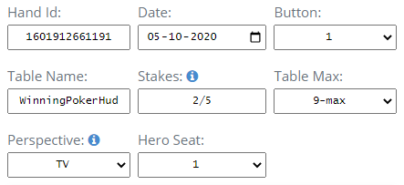
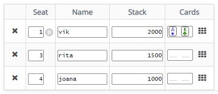
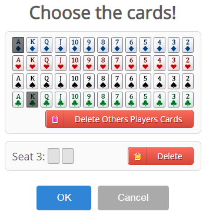
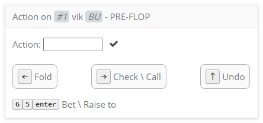
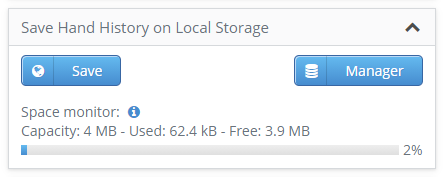
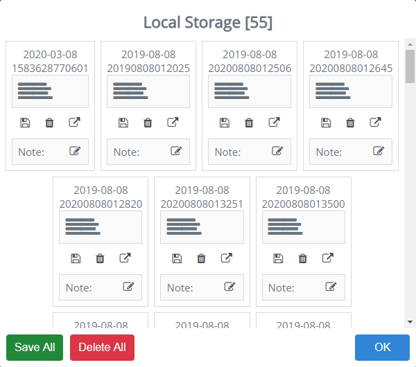
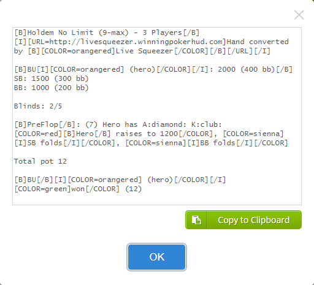
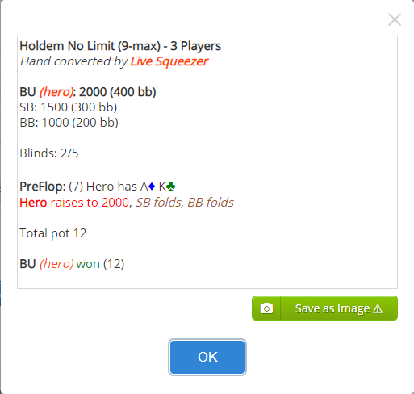

# Live Squeezer

An intuitive and easy to use interface for converting live and tv poker hands to a PokerStars Hand History file format.

See it on action: [Live Squeezer](http://livesqueezer.winningpokerhud.com)

[Support us](https://www.paypal.com/cgi-bin/webscr?cmd=_s-xclick&hosted_button_id=MRHAEHLF9RYAN&source=url), we need you! A small gift is much appreciated. Thank you!

## Input Table Infomation

### Stakes

Format: small blind / big blind (ante) [straddle] [straddle]

E.g.: `10/20(2)[40][80][160]`

Mandatory: small blind / big blind

### Perspective

TV: All known cards show up in the beginning

Hero: Only Hero Cards show up in the beginning; the remaining are shown at showdown or when players went all-in.

## Input Players Information

Options to enter the Hole cards by typing or pick from the follow popup

## Input Players Action

Options to type `fold`, `check`, `call`, the _amount_ for bets and raises or use _arrow keys_ to _fold_, _check/call_ or _undo_ de action

## Save Hand History on File

Options to save the Hand History to a new file or append it to an existing one

The hand will be appended and save to the selected file when `+ Append to:` button is clicked, considere using 'Local Storage save' when converting a full session!

## Save Hand History on Local Storage

Information about the local storage space

Local Storage Manager options

* Save All Hands Histories in one file
* Delete All Hands Histories
* Save the Hand History in a file
* Delete the Hand History from local storage
* Show the Hand History
* Make a note on the Hand History

## Export Hand

Options to Export the hand to a [Online Replayer](http://replayer.winningpokerhud.com) or to a forum formated text

## New Hand History

Options

* New hand - New blank hand
* Next Hand - The button will advance to the next player and the player stacks will adjust accordingly to the action of this hand!

## Forum Format Image

## License

Licensed under the [GPLv3](./LICENSE)